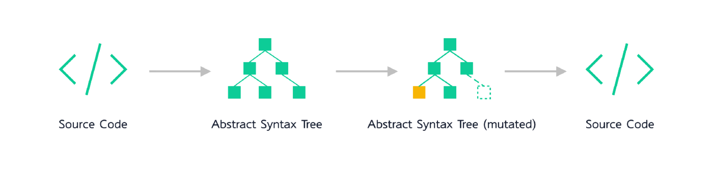
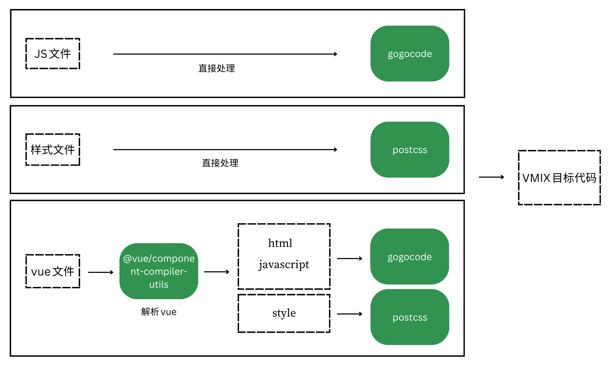

# 基于AST的代码迁移案例

基于AST的代码迁移案例。

## 运行方式

```sh
cd demos/ast-migration
npm i
npm run migration
```
运行上述命令，`.migration`目录下的脚手架会对`src/App.vue`文件中的内容进行自动化迁移，文件中的style、template、js会被自动更新替换。

如果执行成功，`App.vue`中的内容会产生如下变化：

```diff
<template>
	<div id="app" class="app">
		<!-- should be transformed into :onChange="() => {}" -->
-       <swiper @change="() => {}" class="container">hello world</swiper>
+       <swiper :onChange="() => {}" class="container">hello world</swiper>
	</div>
</template>

<script>
export default {
	name: 'App',
	mounted() {
		// should be transformed into `document.parentNode`
-		console.log(document.parentElement)
+		console.log(document.parentNode)
	}
}
</script>

<style lang="scss">
.app {
-	color: blue; // color's value should be transformed to red
+	color: red; // color's value should be transformed to red
}
.container {
-	color: black; // color's value should be transformed to red
+	color: red; // color's value should be transformed to red
}
</style>

```


## 基本思路

自动迁移的基本思路如下：

- 解析：将源代码解析为AST（抽象语法树）。
- 变换：对AST进行变换。
- 再建：根据变换后的AST重新构建生成新的代码。




## 处理流程

demo中对文件的处理流程可以简述如下：

- js文件：交给gogocode处理。
- css / less / scss / sass文件：交给postcss处理。
- vue文件: 
  - template / script部分：交给gogocode处理。
  - style部分：先用@vue/component-compiler-utils解析出style部分，再交给postcss处理。




## 目录结构

```sh
.
├── README.md
├── .migration
│   ├── lib                   #迁移工具：包含updateScript / updateStyle / updateTemplates
│   ├── utils                 #迁移工具
│   ├── bin.js                #迁移脚本
│   └── config.js             #配置项
├── src                       #待迁移的项目目录
│   ├── App.vue               #入口vue
│   ├── main.js               #入口js
```