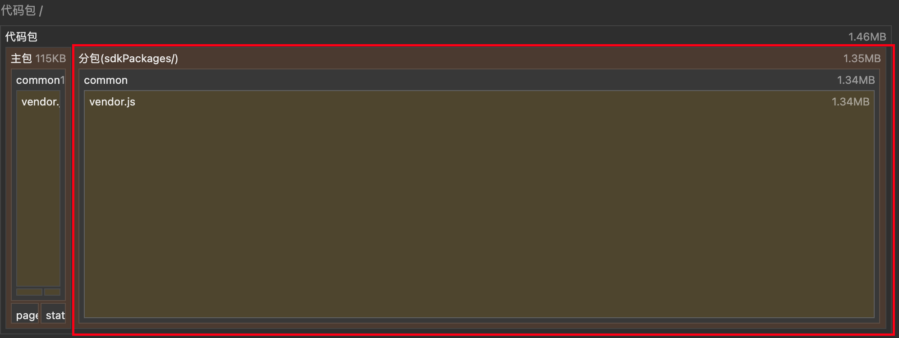

# 微信小程序端智能项目工程化实践案例

## 项目介绍
本项目基于uniapp框架使用了TensorflowJS推理和微信原生推理实现微信小程序端智能能力，并针对以下问题进行了处理：
- 开发体验、支持范围：组合两种方案，保障开发体验，最大化覆盖微信版本范围
- 代码包体积：异步分包加载，解决Tensorflow.js相关依赖超包问题



## 运行环境
- node >= 16.0
- vue = 2.+

## 运行方式
```
# 安装依赖
yarn

# 本地开发
yarn dev:mp-weixin

# 生产构建
yarn build:mp-weixin
```
安装微信开发者工具进行本地调试，appid可替换成自己微信小程序项目的appid

## 目录结构
```
weixin-mini-ai/
├── package.json        # 项目依赖
└── src/
    ├── ai              # 模型推理方法
    ├── pages           # 页面文件存放目录
    ├── sdkPackages     # TensorflowJS异步分包目录
    ├── utils           # 工具方法
    ├── App.vue         # 应用配置
    ├── main.js         # 入口文件
    ├── manifest.json   # 配置应用名称、appid、logo、版本等打包信息
    └── pages.json      # 配置页面路由
```
